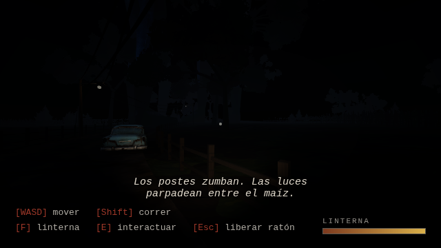

# NIEBLA DEL MAÍZ — Survival Horror

Un juego de terror en primera persona hecho con **Three.js** (sin build, ES modules).
Tu coche se averió en un camino de tierra perdido entre los maizales. Los postes
de luz zumban, las luces parpadean y hay gente ahí fuera… quieta, mirándote.



## Cómo jugar

El juego necesita un **servidor estático** (los ES modules y los `.glb` no cargan
desde `file://`). Desde la raíz del repo:

```bash
# opción 1 — Python
python3 -m http.server 8080

# opción 2 — Node
npx serve .
```

Luego abre <http://localhost:8080> y pulsa **ENTRAR**.

### Controles
| Tecla | Acción |
|-------|--------|
| `WASD` | Moverse |
| `Ratón` | Mirar |
| `Shift` | Correr |
| `F` | Linterna (gasta batería) |
| `E` | Interactuar |
| `Esc` | Liberar el ratón |

## Qué hay en el mundo

- **Terreno** con relieve procedural y una **carretera de tierra** serpenteante,
  tallada y graduada en el terreno (texturas PBR procedurales con normales).
- **Postes de luz** con lámparas parpadeantes y una **maraña de cables**
  (catenarias) cruzando la carretera, más algún cable caído al suelo.
- **Maizales largos** en hileras, miles de tallos instanciados que se mecen con el viento.
- **Árboles realistas procedurales**: tronco y ramas recursivas con corteza PBR y
  racimos de hojas en planos cruzados con alpha y variación de color (otoñal/seco).
- **Cercas** de madera bordeando la carretera y los campos.
- **Casas, coches y camiones** estilo PS1 (modelos `.glb`).
- **Las figuras**: NPCs estilo PS1 que giran lentamente para mirarte.
- Cielo nocturno con **luna, estrellas y niebla**, iluminación con sombras.
- Audio ambiente sintetizado (viento, pasos, linterna) vía WebAudio.

## Estructura

```
index.html              # UI, pantalla de carga, import map
src/
  main.js               # render, carga, bucle de juego
  worldgen.js           # heightfield + carretera (coherentes)
  terrain.js            # malla del terreno + cinta de carretera
  textures.js           # texturas PBR procedurales (canvas)
  trees.js              # generador de árboles + instancing + viento
  cornfield.js          # maizales instanciados con viento
  fences.js             # cercas instanciadas
  lightpoles.js         # postes + cables (catenarias)
  models.js             # carga de .glb (look PS1) + normalización
  world.js              # ensambla todo el escenario
  player.js             # cámara FPS, linterna, colisiones, head-bob
  sky.js                # cielo, luna, estrellas, niebla, luces
  audio.js              # atmósfera sintetizada (WebAudio)
assets/models/          # modelos .glb (PS1)
assets/source/          # fuentes originales (.zip)
vendor/three/           # Three.js r160 + addons (vendorizado)
```

## Estética

Contraste intencionado: **entorno de naturaleza realista con PBR** (terreno,
corteza, hojas, maíz, cables) frente a **personajes y casas low-poly estilo PS1**
(filtrado *nearest*, texturas crudas). Es el look "PSX horror" clásico.
